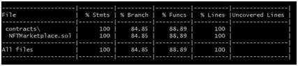

# NFT Marketplace Project
This project is an NFT marketplace that allows users to buy and sell ERC721 and ERC1155 NFTs. The marketplace is built using the UUPS proxy pattern, which allows for easy upgrades to the smart contract. The smart contract is tested using unit tests to ensure that it is working correctly. The deploy script is used to deploy the smart contract to the blockchain, and the upgrade script is used to upgrade the smart contract when necessary. The smart contract is verified on the blockchain to ensure that it is secure and working correctly. The marketplace only accepts ETH as a payment method.

## Users
### Feature of contract
1. Selling NFTs 
2. Buying NFTs
3. Pause & unPause NFTs selling
4. Updating Selling details of NFTs
5. Remove selling of NFTs

### Security if offers
1. Re-entracy : All public functions are secured with reentracy guard

### All you need to know as an user
- Selling
    1. This contract takes nft from user it order to sell on marketplace.
    2. Seller must own NFT in order to sell
    3. Payment mode is ETH
    4. Seller can anytime remove NFT from listing and get back there token
    5. Seller also as the option to pause and unpause there NFT selling
- Buying
    1. Any user can buy NFT if they are listed 
    2. Payment method is in ETH only

### Future plans
- Accepting Nfts direclty from user and then later on add details for selling.
- Allowing erc20 token payment methods 

## Developers
### Things to know as an developer 

### Upgrading contracts requirements 
- All earlier state vairables and mapping should be in same order.
- New added variables and mapping should be added after them.
- For better clearity please specify the version of contract in `version` function.

### Helper commands 
- Running unit test 
    ```
    npx hardhat test
    ```
- Running test coverage
    ```
    npx hardhat coverage
    ```    
- Runnig deploy/upgrade scripts
    ```
    npx hardhat run scripts/<fileName> --network <networkToDeployTo>
    ```
- Verifying contract from cli
    NOTE: If not constructure value then don't pass any value 
    ```
    npx hardhat verify --network <contractDeployedAt> <addressOfContract> <constructorValue>
    ```   
- Running slither analysis
    ```
    slither .
    ```

### Hardhat plugins used 
1. hardhat-upgrades - for deploying proxy contracts
2. hardhat-etherscan - for verifying contract from cli
3. solidity-coverage - for coverage [NOTE: currently removed for some package breakages]

### pthon packages
1. Slither
    - Install 
        ```
        pip3 install slither-analyzer
        ```
    - Need to add path variable defining it    

### Contract Addresses
- Polygon Mumbai
    - Implementation :
        - V1 : https://mumbai.polygonscan.com/address/0x67fbab75eeb889566fb9f9b7b3e1ee39c00ea588
        - V2 : https://mumbai.polygonscan.com/address/0x1Bd86087c35544969f1202d9914af381F5831B77
    - Proxy : https://mumbai.polygonscan.com/address/0x928d73c67A934781A54d5D8e9f3B7D9C9D75b68B

### Coverage 


### Some other info
1. For skipping the contract for coverage testing
    - We can all the skip contract name in `.solcover.js` file.
2. `.openzepplin` file consist of all the contract deployed from this projects on diffent chains

## Author
Sufiyan
